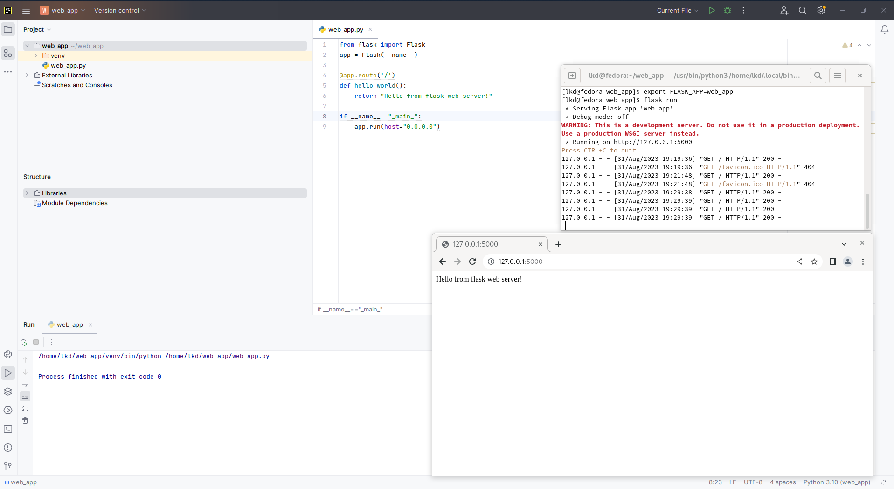
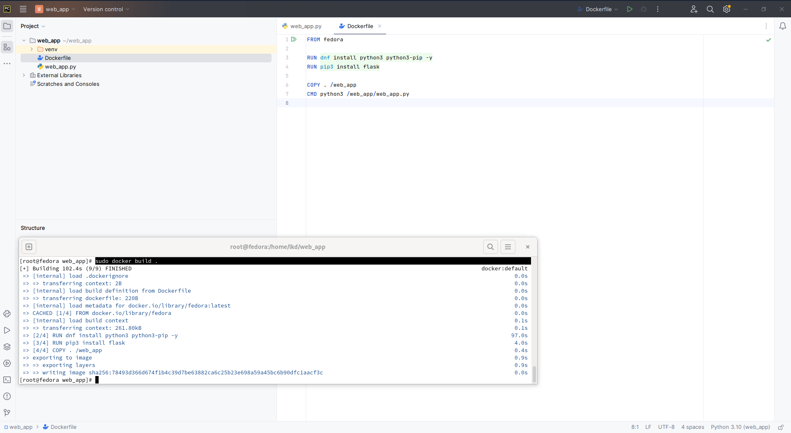

# Контейнеризация (Containerization)
   

## Docker Compose и Docker Swarm

### Задание:

    1. создать сервис, состоящий из 2 различных контейнеров: 1 - веб, 2 - БД
    2. далее необходимо создать 3 сервиса в каждом окружении (dev, prod, lab)
    3. по итогу на каждой ноде должно быть по 2 работающих контейнера
    4. выводы зафиксировать

### Реализация:

#### WebApp: Python (Flask)
1.Запуск, проверка

2.Dockerfile, сборка

