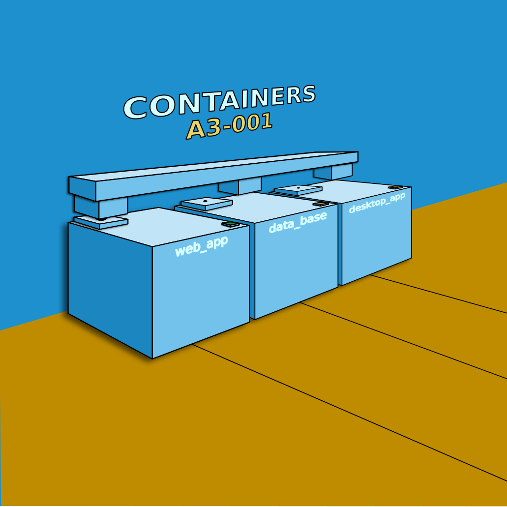

# Контейнеризация (Containerization)
   

## Docker Compose и Docker Swarm

### Задание:

    Cоздать сервис, состоящий из 2 различных контейнеров: 1 - веб, 2 - БД

### Реализация:

#### 1. Сервис состоящий из веб-контейнера и контейнера базы данных, с помощью Docker Compose (пошаговая инструкция):

    1. Создайте новый каталог для своего проекта и перейдите к нему в терминале.
    2. Создайте новый файл с именем docker-compose.yml в каталоге проекта.
    3. В файле docker-compose.yml определите веб-службы и службы баз данных, используя services (ключевое слово).
    4. Для веб-службы укажите используемый образ, открытые порты и любые переменные среды или тома для монтирования.
    5. Для службы базы данных укажите используемый образ, открытые порты и любые переменные среды или тома для монтирования.
    6. Определите сеть для связи служб с помощью networks (ключевое слово).
    7. Сохраните docker-compose.ymlфайл.
    8. В терминале выполните команду docker-compose up для запуска служб.
    9. Убедитесь, что службы работают правильно, посетив веб-службу в веб-браузере или используя такой инструмент, как curl (запросы).
    10. Когда вы закончите, запустите команду docker-compose down.

##### Пример файла docker-compose.yml, который определяет веб-службу, работающую на порту 80, и службу базы данных, работающую на порту 5432:

    В этом файле определена веб-служба, на которой работает последняя версия веб-сервера Nginx,
    с открытым портом 80 и подключенным томом для обслуживания статических файлов. В нем так же определена служба базы данных,
    на которой работает последняя версия PostgreSQL, с открытым портом 5432 и подключенным томом для хранения данных.
    Службы взаимодействуют в сети под названием my-network. 
